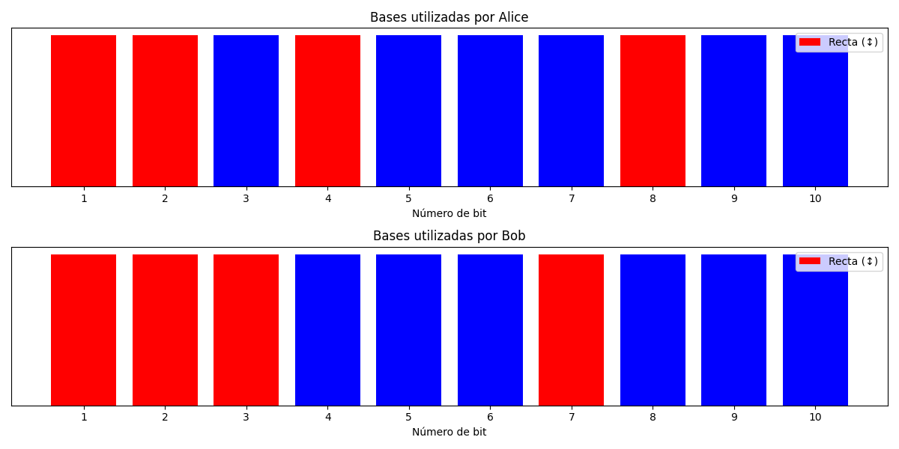

# Simulador del Protocolo BB84

Este repositorio contiene una implementación en Python del protocolo BB84 para la distribución de claves cuánticas (QKD). El simulador permite visualizar cómo Alice y Bob pueden establecer una clave secreta compartida utilizando propiedades cuánticas.

## Contenido del Repositorio
- `Simulacion.py`: Implementación del protocolo BB84 básico
- `README.md`: Este archivo con la documentación

## Descripción del Protocolo BB84
El protocolo BB84 es uno de los métodos más conocidos de QKD. Fue propuesto por Charles Bennett y Gilles Brassard en 1984. El protocolo utiliza las propiedades cuánticas de los fotones para establecer una clave secreta entre dos partes, con la garantía de que cualquier intento de interceptación podrá ser detectado.

### Proceso básico:
1. Alice genera bits aleatorios y los codifica en fotones usando bases aleatorias
2. Bob mide los fotones usando también bases aleatorias
3. Alice y Bob comparan públicamente qué bases utilizaron (sin revelar los bits)
4. Solo conservan los bits donde usaron la misma base
5. La clave final está formada por estos bits coincidentes

## Requisitos
Para ejecutar este simulador, necesitas:
- Python
- Bibliotecas de Python:
   - `numpy`: Para operaciones con números aleatorios
   - `matplotlib`: Para visualizar el historial de bases
   - `tabulate`: Para mostrar los resultados en formato de tabla

Puedes instalar estas dependencias con:
```bash
pip install numpy matplotlib tabulate
```

## Uso del Simulador
Para ejecutar el simulador, simplemente ejecuta el script principal:
```bash
python Simulacion.py
```

El programa te guiará para:
- Ingresar el número de bits a transmitir
- Mostrar los resultados en una tabla formateada
- Visualizar las bases utilizadas gráficamente

## Estructura del Código
El simulador está organizado en varias funciones principales:

`simulate_bb84(n_bits)`: Esta función realiza la simulación completa del protocolo:
- Genera bits aleatorios para Alice
- Genera bases aleatorias para Alice y Bob
- Calcula los fotones que envía Alice
- Simula las mediciones de Bob
- Compara las bases y determina qué bits usar para la clave

`display_simulation(results)`: Muestra los resultados de la simulación en una tabla formateada, incluyendo:
- Bits de Alice y sus bases
- Fotones enviados
- Bases de Bob y bits recibidos
- Coincidencia de bases y bits utilizables

`visualize_bases(results)`: Crea una visualización gráfica de las bases utilizadas por Alice y Bob, lo que permite ver fácilmente dónde coincidieron.

`main()`: Maneja la interacción con el usuario y la ejecución de la simulación.

## Ejemplo de Simulación
A continuación se muestra un ejemplo de salida del simulador para una transmisión de 10 bits:


- Total de bits transmitidos: 10
- Bits útiles para la clave: 6 
- Porcentaje útil: 60.00%
- Clave secreta: 1 0 1 0 0 0

Además, el programa mostrará un gráfico con las bases utilizadas por Alice y Bob, donde:
- Rojo representa la base recta (↕)
- Azul representa la base diagonal (↗)


